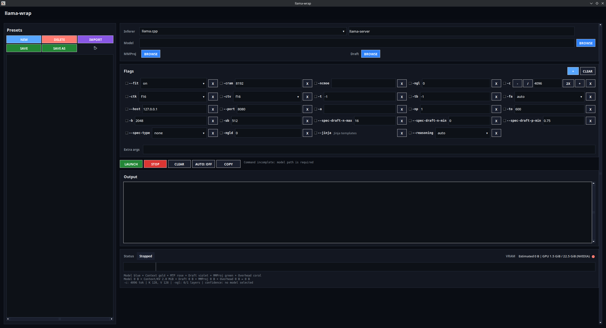

# llama-wrap

`llama-wrap` is a lightweight launcher and local-ops helper for `llama-server`-compatible GGUF model servers.

It helps you build, import, save, run, diagnose, probe, benchmark, and stress-test launch commands without retyping long flag lists. Use the desktop GUI when you want a visual launcher, or the CLI when you are working from a terminal or a headless machine.

It is not a chat UI, model downloader, or model manager.



## Quick Start

### From Source

```bash
git clone https://github.com/chelij/llama-wrap.git
cd llama-wrap
python llamawrap.py
```

When started from a terminal, `llamawrap.py` opens the interactive CLI. When launched from a desktop/double-click context, it opens the GUI when Tk/display support is available.

Force a mode when needed:

```bash
python llamawrap.py --gui
python llamawrap.py --cli
python llamawrap.py --mode auto
```

### Release Build

Download and extract the release archive for your platform.

Linux:

```bash
./llama-wrap
```

Windows:

```powershell
.\llama-wrap.exe
```

macOS:

```bash
open llama-wrap.app
```

The release build follows the same idea: desktop launch opens the GUI, terminal launch opens the CLI where the platform/package supports terminal detection. The standalone `llamawrap-cli.py` script is also included in release archives.

### Create Your First Preset

Interactive CLI:

```bash
python llamawrap.py
```

Then press `c` to create a preset, or `i` to import an existing `llama-server` command.

Direct CLI:

```bash
python llamawrap.py create "My Model" /models/model.gguf --set -ngl all --set -c 32768
python llamawrap.py run "My Model"
```

Import an existing command:

```bash
python llamawrap.py import "My Model" llama-server -m /models/model.gguf -ngl all -c 32768
python llamawrap.py run "My Model"
```

## Basic Workflow

1. Choose a model `.gguf` file.
2. Optionally choose an MMProj `.gguf` file for vision/multimodal models.
3. Optionally choose a smaller draft `.gguf` model for speculative decoding.
4. Adjust common launch flags such as GPU layers, context size, host, and port.
5. Add custom flags or extra args when needed.
6. Launch the server.
7. Save the setup as a preset for reuse.

## Features

- **GUI and CLI**: use a desktop launcher or terminal browser from the same project.
- **Shared ops core**: GUI and CLI use the same command building, preset parsing, endpoint checks, benchmark formatting, and stress-test logic.
- **Presets**: save, load, rename, delete, create, and import launch configurations.
- **Command import**: paste an existing `llama-server` command and turn it into a preset.
- **Model selectors**: browse for model, MMProj, and draft `.gguf` files.
- **Flag editing**: edit common flags, add custom flags, or pass advanced extra args.
- **Diagnostics**: run Doctor, Probe, Bench, and Stress from the GUI or CLI.
- **Benchmarks**: save local JSON results, with optional CSV output from the CLI.
- **Context stress**: test large-context behavior with fill/decode stages, sustained synthetic coding-agent turns, and boundary probes.
- **Auto-restart**: restart a server if it crashes.
- **Stop logging**: the GUI log reports when a stop request is sent and when the server has stopped.
- **Live output**: view server logs in the GUI or terminal.
- **Session stats**: track average TTFT, tok/s, and restart count per preset.
- **VRAM estimate and calibration**: estimate memory use from model size, GGUF metadata, context, KV cache, GPU layers, draft model, and MMProj, then calibrate matching presets from runtime logs/GPU readings after launch.

## Common Tasks

### Open GUI Explicitly

```bash
python llamawrap.py --gui
```

### Open CLI Explicitly

```bash
python llamawrap.py --cli
```

### List Presets

```bash
python llamawrap.py list
```

### Show Preset Details

```bash
python llamawrap.py show "My Model"
```

### Create a Preset

```bash
python llamawrap.py create "My Model" /models/model.gguf --set -ngl all --set -c 32768
```

### Import a Launch Command

```bash
python llamawrap.py import "My Model" llama-server -m /models/model.gguf -ngl all -c 32768 --port 8080
```

### Edit a Flag

```bash
python llamawrap.py set "My Model" --port 8080
python llamawrap.py enable "My Model" --jinja
python llamawrap.py disable "My Model" -ngl
```

### Run a Preset

```bash
python llamawrap.py run "My Model"
python llamawrap.py run "My Model" --auto
```

### Run Diagnostics

These commands expect the configured endpoint to be running, except for the local executable/path parts of Doctor.

```bash
python llamawrap.py doctor "My Model"
python llamawrap.py probe "My Model"
python llamawrap.py bench "My Model"
python llamawrap.py stress "My Model"
```

Bench runs a warmup plus several streamed iterations and reports median TTFT, generation tok/s, and prefill tok/s (when the server provides timings). Results are saved under the llama-wrap data directory (`benchmarks/`) by default. For CSV output:

```bash
python llamawrap.py bench "My Model" --csv
```

### Export or Import Preset Bundles

Preset bundle import/export is CLI-only. It is separate from the older `import <name> <command>` command that turns a launch command into one preset.

```bash
python llamawrap.py export-presets --out presets.json --portable
python llamawrap.py import-presets presets.json
```

## Interactive CLI

Run:

```bash
python llamawrap.py --cli
```

Main menu:

```text
c     create a new preset
i     import a pasted launch command
r     reload presets
q     quit
```

After selecting a preset:

```text
s     show full details
f     edit flags
r     run (launch server)
a     run with auto-restart on crash
d     delete this preset
b     back to list
```

In the create flow, model, MMProj, and draft model fields use a numbered file selector that shows folders and `.gguf` files.

Selector controls:

```text
number      open folder or select file
0           parent folder
p <path>    paste a path manually
q           cancel
blank       skip optional fields
```

The interactive flag editor supports Tab completion for commands and flag names:

```text
ena + Tab          enable
enable --p + Tab   --port, --presence-penalty, ...
set -n + Tab       -ngl, -np, ...
```

## CLI Reference

You can use either `python llamawrap.py <command>` or `llamawrap-cli <command>`.

```bash
llamawrap-cli list
llamawrap-cli create "My Model" /models/model.gguf --set -ngl all --set -c 32768
llamawrap-cli import "My Model" llama-server -m /models/model.gguf -ngl all -c 32768
llamawrap-cli doctor "My Model"
llamawrap-cli probe "My Model"
llamawrap-cli bench "My Model" --csv
llamawrap-cli stress "My Model"
llamawrap-cli export-presets --out presets.json --portable
llamawrap-cli import-presets presets.json
llamawrap-cli show "My Model"
llamawrap-cli run "My Model" --auto
llamawrap-cli set "My Model" --port 8080
llamawrap-cli enable "My Model" --jinja
llamawrap-cli disable "My Model" -ngl
llamawrap-cli rename "Old Name" "New Name"
llamawrap-cli delete "My Model"
llamawrap-cli help run
```

## Presets and Storage

Presets are stored in `history.json`. The file is found in this order:

- `LLAMA_WRAP_HISTORY` environment variable, when set
- an existing `history.json` next to `llamawrap.py` / the launcher binary (portable installs keep working)
- otherwise the per-user data directory: `~/.config/llama-wrap` on Linux, `~/Library/Application Support/llama-wrap` on macOS, `%APPDATA%\llama-wrap` on Windows

New installs default to the per-user directory so the app works even when installed somewhere read-only. Writes are atomic (temp file + rename), so a crash mid-save cannot corrupt existing presets.

Each preset stores:

- model path, MMProj path, and draft model path
- enabled flags and values
- custom and hidden flag rows
- extra args
- selected inferer and executable
- session stats from the last run

Recent run commands are also saved, capped to the latest 100 entries.

Benchmark outputs and rotating server session logs are stored under the same data directory (`benchmarks/` and `logs/`). A portable `.llama-wrap` folder next to the app is used instead when it already exists; that local folder is ignored by git and is safe to delete when you no longer need the reports.

## Importing Existing Commands

Use the GUI import button or CLI import command to paste an existing launch command:

```bash
llama-server -m /models/model.gguf -ngl all -c 32768 --host 127.0.0.1 --port 8080
```

Recognized flags are loaded into preset fields. Unknown flags are preserved as custom flags or extra args so the command is not silently lost.

## Session Stats

Every time you run a preset, `llama-wrap` tracks:

- **Average TTFT**: Time To First Token, from prompt evaluation timing.
- **Average tok/s**: weighted generation throughput.
- **Auto-restarts**: restart count when `--auto` is used.

Stats are computed from the server `/metrics` endpoint when available. `--metrics` is automatically added to launches so stats can be collected.

Example:

```text
Last:  53.1ms TTFT | 41.51 tok/s
Last:  53.1ms TTFT | 41.51 tok/s | 3 restarts
```

The metrics endpoint is available at:

```text
http://127.0.0.1:<port>/metrics
```

## VRAM Estimate

The VRAM display starts as a pre-launch estimate. It uses:

- model file size
- parsed GGUF metadata
- context size (`-c`)
- KV cache type
- GPU layers
- draft model size
- MMProj size
- runtime overhead

Values are shown in binary units such as MiB and GiB.

After a model is launched, `llama-wrap` watches `llama-server` allocation log lines and GPU process/total VRAM readings. When the observed runtime value matches the current preset command and model file signature, a calibration record is stored in `history.json` and the GUI shows the calibrated value on future matching loads. Existing preset fields remain backward compatible.

Calibration is intentionally conservative: implausibly tiny process readings are ignored unless allocation logs are available.

## Diagnostics

The GUI Diagnostics row runs these actions in the background and streams readable output into the existing log panel:

- **Doctor**: checks executable/path setup, configured host/port, port availability, `/health`, `/v1/models`, and `/v1/chat/completions`.
- **Probe**: sends one small OpenAI-compatible chat completion request.
- **Bench**: sends one controlled prompt, reports latency/token speed when available, and saves a JSON result locally.
- **Stress**: detects effective runtime context, runs staged fill/decode requests, sustained synthetic coding-agent turns, boundary probes, and prints a practical working-limit summary.

The CLI exposes the same diagnostics through `doctor`, `probe`, `bench`, and `stress`.

Example diagnostic output:

```text
Doctor: My Model
  executable       PASS  llama-server found
  model path       PASS  /models/model.gguf
  endpoint         PASS  http://127.0.0.1:8080
  /v1/models       PASS  model list returned
  chat completion  PASS  42 tokens/sec estimate available
```

## Requirements

- Python 3.10 or newer
- Tkinter for GUI mode
- `llama-server` from `llama.cpp`, or another compatible executable
- at least one GGUF model file
- optional MMProj GGUF file for multimodal/vision models
- optional smaller draft GGUF file for speculative decoding

The CLI does not require Tkinter.

## Inferers

- `llama.cpp`: uses the standard `llama-server` executable.
- `Custom`: for other llama-server-compatible executables.

## Limits

`llama-wrap` does not:

- download models
- manage chat conversations
- replace Open WebUI, LM Studio, or the built-in llama.cpp Web UI
- provide a hosted server

It is a small local process wrapper for people who already use `llama-server`-compatible inferers.

## License

MIT License. See [LICENSE](LICENSE).

## Support

If this is useful to you, donations are welcome:

[https://ko-fi.com/chelib](https://ko-fi.com/chelib)
